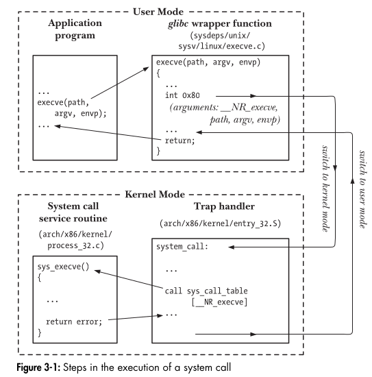

# **Mastering System Calls in Linux** 🚀

Welcome to the **ultimate deep dive** into system calls! We’re going to break everything down **as far as humanly possible**, explain concepts with **fun analogies**, and give you **simple yet powerful examples** that will make system calls second nature.

---

## **1. What is a System Call?** 🤔
Imagine you're playing a **video game**. You can move your character, interact with objects, and attack enemies. But can your character **directly change** how the game works (e.g., modify the game engine)? No!

Similarly, a **user-space program** (your application) cannot directly access the **OS kernel** or hardware. Instead, it has to ask the kernel for help using **system calls (syscalls)**.

### 🔍 **Breaking It Down:**
- **System** → Refers to the **operating system (OS)**, specifically the **kernel**.
- **Call** → A **request** made by a user program to the OS.

### 🎮 **Analogy: Video Game vs. OS**
| You (User Program) | Kernel (Game Engine) | System Call (Command) |
|-----------------|----------------|----------------|
| A game character | The game engine | Asking the game engine to save progress |
| A C program | The OS Kernel | Asking the OS to open a file |

### **🛑 Why Not Access Hardware Directly?**
The OS protects system resources to **prevent crashes, security issues, and conflicts**. Imagine if one program could just delete files from another—chaos! 😱

Thus, we need a **safe and controlled way** to access hardware: **system calls!**

---

## **2. System Call vs. Function Call** 🏛️📜
A lot of beginners confuse **system calls** with **normal function calls**. Let’s clear that up.

| Feature | System Call 🏛️ | Function Call 📜 |
|---------|---------------|-----------------|
| Runs in | **Kernel Mode** | **User Mode** |
| Who executes? | **Kernel (OS)** | **Your Program** |
| Accesses hardware? | **Yes** | **No** |
| Speed | **Slower** (context switch) | **Faster** (stays in user space) |
| Example | `read()`, `write()`, `fork()` | `printf()`, `strlen()` |

### **📌 Example: Function Call vs. System Call**
```c
#include <stdio.h>
#include <unistd.h>

int main() {
    printf("Hello, World!\n"); // Function call (user-space)
    write(1, "Hello, World!\n", 14); // System call (kernel-space)
    return 0;
}
```
- `printf()` is **just a function** that eventually calls `write()`.
- `write()` is **a system call** that actually interacts with the OS!

### **🕵️‍♂️ How to Verify This?**
Use `strace` to see system calls:
```sh
strace ./a.out
```
Output:
```
write(1, "Hello, World!\n", 14) = 14
```
This proves that **printf() internally calls write()**!

---

## **3. How System Calls Work Internally** 🏗️
Let’s go step by step. How does calling `write()` **actually make its way to the OS**? 🛤️

### **Step 1: User Program Calls a Wrapper Function**
When you call `write(fd, buf, count)`, you’re actually calling a **wrapper function** from the **C standard library (glibc)**.

### **Step 2: Moving Arguments to Registers**
Before calling the OS, the wrapper function:
- Moves system call **arguments** into specific **CPU registers**.
- Loads the **system call number** into the `%eax` register.

### **Step 3: Trap Instruction (Switching to Kernel Mode)**  
This is the **most critical step** in executing a system call because this is where the program **jumps from user mode to kernel mode**. This happens through a **trap instruction**, which is a special CPU instruction designed to "trap" execution into the kernel.

---

### **🔹 What is a Trap Instruction?**  
A **trap instruction** is a CPU instruction that transfers control from **User Mode** to **Kernel Mode**. This is required because:  
✅ User programs **cannot** directly access hardware (e.g., disks, network, memory).  
✅ Kernel Mode has **higher privileges** to execute sensitive operations.  

There are **different types of trap instructions** depending on the architecture:  

| **Architecture** | **Trap Instruction** |
|---------------|------------------|
| **x86-32 (32-bit Intel)** | `int 0x80` |
| **x86-64 (64-bit Intel & AMD)** | `syscall` |
| **ARM (used in phones, embedded devices)** | `svc` (Supervisor Call) |
| **RISC-V** | `ecall` (Environment Call) |

---

### **🔹 Trap Instructions on x86 Architectures**
### **1️⃣ x86-32 (32-bit) → `int 0x80`**
On **older 32-bit Intel CPUs**, Linux system calls were made using a software interrupt instruction:

```assembly
mov eax, 1       ; System call number (sys_exit)
mov ebx, 0       ; Argument (exit code)
int 0x80         ; Trap instruction (switch to Kernel Mode)
```
✅ `int 0x80` is a **software interrupt** that jumps to **Interrupt Vector Table (IVT)** at index `0x80`.  
✅ The kernel executes the system call and returns the result.  

🔹 **Why is `int 0x80` slow?**  
- It **switches the CPU state completely**, saving and restoring more registers.  
- It uses an **Interrupt Descriptor Table (IDT)**, which adds extra overhead.  

### **2️⃣ x86-64 (64-bit) → `syscall`**
On **modern 64-bit processors**, Linux introduced the `syscall` instruction for better performance:

```assembly
mov rax, 60      ; System call number (sys_exit)
mov rdi, 0       ; Argument (exit code)
syscall          ; Trap instruction (switch to Kernel Mode)
```

✅ `syscall` is **faster than `int 0x80`** because:  
1. It **doesn’t need the Interrupt Descriptor Table (IDT)**.  
2. It **uses fewer registers**, reducing the context-switching overhead.  
3. It **optimizes CPU pipeline execution**, making it much faster.  

🔹 **Why the change?**  
- `syscall` was introduced because `int 0x80` became **too slow for modern CPUs**.  
- It reduces **syscall latency** by about **2× faster** compared to `int 0x80`.  
- All modern Linux distros on x86-64 **use `syscall` instead of `int 0x80`**.

---

### **🔹 What Happens Internally When the Trap Occurs?**
1. The `syscall` or `int 0x80` instruction is executed.  
2. The CPU:  
   - **Saves the current user-mode program state** (registers, stack, etc.).  
   - **Switches to Kernel Mode**.  
   - **Jumps to the syscall handler (`syscall_entry`) in the Linux kernel**.  
3. The kernel looks up the **syscall number in the syscall table**.  
4. The correct system call function is executed.  
5. The kernel **returns back to User Mode** and restores the program state.  

---

### **🔹 Why is This Important?**
1. **Security** → Prevents user programs from directly accessing hardware.  
2. **Performance** → `syscall` is optimized for speed on modern CPUs.  
3. **Portability** → Different architectures use different trap instructions (`syscall`, `int 0x80`, `svc`, `ecall`).  

---

### **Example: Making a System Call Without Using libc**
Normally, we call system calls using C functions like `write()`. But we can directly invoke `syscall` using assembly:

#### **x86-64 Example (Linux)**
```assembly
section .text
global _start

_start:
    mov rax, 1       ; syscall number for sys_write
    mov rdi, 1       ; file descriptor (1 = stdout)
    mov rsi, msg     ; pointer to message
    mov rdx, 13      ; message length
    syscall          ; invoke kernel
     
    mov rax, 60      ; syscall number for sys_exit
    xor rdi, rdi     ; exit code 0
    syscall          ; invoke kernel

section .data
msg db "Hello, world", 10
```
🔹 This prints `"Hello, world"` to the terminal using **only system calls**.


### **Step 4: Kernel Executes the System Call**
The kernel:
1. Reads the **system call number** from `%eax`.
2. Looks it up in `sys_call_table`.
3. Executes the correct function inside the OS.

### **Step 5: Return to User Mode**
- The kernel stores the **return value** in `%eax`.
- Execution jumps back to **user space**.

### **🔍 Visual Representation**:
```
+----------------------------------+
| User Mode (Application Program) |
+----------------------------------+
       |  (1) Calls write() wrapper
       V
+----------------------------------+
| User Mode (C Library - glibc)   |
+----------------------------------+
       |  (2) Moves args to registers
       |  (3) Triggers syscall
       V
+----------------------------------+
| Kernel Mode (System Call)       |
+----------------------------------+
       |  (4) Finds system call number
       |  (5) Executes function
       |  (6) Returns result
       V
+----------------------------------+
| Back to User Mode               |
+----------------------------------+
```



### **Example: Manually Invoking a System Call (Without Wrappers!)**
```c
#include <unistd.h>
#include <sys/syscall.h>

int main() {
    syscall(SYS_write, 1, "Hello, Syscall!\n", 16);
    return 0;
}
```
- Instead of calling `write()`, we **directly invoke** `syscall()`.
- `SYS_write` is the syscall number for `write()`.

---

## **4. How to List System Calls** 📜
Want to see a list of system calls available? Run:
```sh
man 2 syscalls
```
To check the number for a specific system call, run:
```sh
cat /usr/include/asm/unistd_64.h | grep __NR_write
```
Output:
```
#define __NR_write 1
```
This tells us `write()` is syscall **number 1**!

---

## **5. Measuring System Call Overhead** ⚡
System calls are **slower** than function calls due to **context switching**. Let’s measure it!

### **Benchmark: System Call vs Function Call**
```c
#include <stdio.h>
#include <unistd.h>
#include <time.h>

int simple_function() { return 42; }

int main() {
    struct timespec start, end;
    long long ns;

    // Benchmark system call
    clock_gettime(CLOCK_MONOTONIC, &start);
    for (int i = 0; i < 1000000; i++)
        getpid();
    clock_gettime(CLOCK_MONOTONIC, &end);
    ns = (end.tv_sec - start.tv_sec) * 1000000000LL + (end.tv_nsec - start.tv_nsec);
    printf("System Call Time: %lld ns\n", ns);

    // Benchmark function call
    clock_gettime(CLOCK_MONOTONIC, &start);
    for (int i = 0; i < 1000000; i++)
        simple_function();
    clock_gettime(CLOCK_MONOTONIC, &end);
    ns = (end.tv_sec - start.tv_sec) * 1000000000LL + (end.tv_nsec - start.tv_nsec);
    printf("Function Call Time: %lld ns\n", ns);

    return 0;
}
```

# **Mastering System Calls in Linux: The Deepest Dive Ever** 🚀

Welcome to the **ultimate deep dive** into system calls! We’re going to break everything down **as far as humanly possible**, explain concepts with **fun analogies**, and give you **simple yet powerful examples** that will make system calls second nature.

---

## **1. What is a System Call?** 🤔
Imagine you're playing a **video game**. You can move your character, interact with objects, and attack enemies. But can your character **directly change** how the game works (e.g., modify the game engine)? No!

Similarly, a **user-space program** (your application) cannot directly access the **OS kernel** or hardware. Instead, it has to ask the kernel for help using **system calls (syscalls)**.

### 🔍 **Breaking It Down:**
- **System** → Refers to the **operating system (OS)**, specifically the **kernel**.
- **Call** → A **request** made by a user program to the OS.

### 🎮 **Analogy: Video Game vs. OS**
| You (User Program) | Kernel (Game Engine) | System Call (Command) |
|-----------------|----------------|----------------|
| A game character | The game engine | Asking the game engine to save progress |
| A C program | The OS Kernel | Asking the OS to open a file |

### **🛑 Why Not Access Hardware Directly?**
The OS protects system resources to **prevent crashes, security issues, and conflicts**. Imagine if one program could just delete files from another—chaos! 😱

Thus, we need a **safe and controlled way** to access hardware: **system calls!**

---

## **2. System Call vs. Function Call** 🏛️📜
A lot of beginners confuse **system calls** with **normal function calls**. Let’s clear that up.

| Feature | System Call 🏛️ | Function Call 📜 |
|---------|---------------|-----------------|
| Runs in | **Kernel Mode** | **User Mode** |
| Who executes? | **Kernel (OS)** | **Your Program** |
| Accesses hardware? | **Yes** | **No** |
| Speed | **Slower** (context switch) | **Faster** (stays in user space) |
| Example | `read()`, `write()`, `fork()` | `printf()`, `strlen()` |

### **📌 Example: Function Call vs. System Call**
```c
#include <stdio.h>
#include <unistd.h>

int main() {
    printf("Hello, World!\n"); // Function call (user-space)
    write(1, "Hello, World!\n", 14); // System call (kernel-space)
    return 0;
}
```
- `printf()` is **just a function** that eventually calls `write()`.
- `write()` is **a system call** that actually interacts with the OS!

### **🕵️‍♂️ How to Verify This?**
Use `strace` to see system calls:
```sh
strace ./a.out
```
Output:
```
write(1, "Hello, World!\n", 14) = 14
```
This proves that **printf() internally calls write()**!

---

## **3. How System Calls Work Internally** 🏗️
Let’s go step by step. How does calling `write()` **actually make its way to the OS**? 🛤️

### **Step 1: User Program Calls a Wrapper Function**
When you call `write(fd, buf, count)`, you’re actually calling a **wrapper function** from the **C standard library (glibc)**.

### **Step 2: Moving Arguments to Registers**
Before calling the OS, the wrapper function:
- Moves system call **arguments** into specific **CPU registers**.
- Loads the **system call number** into the `%eax` register.

### **Step 3: Trap Instruction** 🚀
The function executes a **trap instruction** (`syscall` on x86-64, `int 0x80` on x86-32). This:
- Switches the CPU from **User Mode** → **Kernel Mode**.
- Jumps to a **predefined kernel entry point**.

### **Step 4: Kernel Executes the System Call**
The kernel:
1. Reads the **system call number** from `%eax`.
2. Looks it up in `sys_call_table`.
3. Executes the correct function inside the OS.

### **Step 5: Return to User Mode**
- The kernel stores the **return value** in `%eax`.
- Execution jumps back to **user space**.

### **🔍 Visual Representation**:
```
+----------------------------------+
| User Mode (Application Program) |
+----------------------------------+
       |  (1) Calls write() wrapper
       V
+----------------------------------+
| User Mode (C Library - glibc)   |
+----------------------------------+
       |  (2) Moves args to registers
       |  (3) Triggers syscall
       V
+----------------------------------+
| Kernel Mode (System Call)       |
+----------------------------------+
       |  (4) Finds system call number
       |  (5) Executes function
       |  (6) Returns result
       V
+----------------------------------+
| Back to User Mode               |
+----------------------------------+
```

### **Example: Manually Invoking a System Call (Without Wrappers!)**
```c
#include <unistd.h>
#include <sys/syscall.h>

int main() {
    syscall(SYS_write, 1, "Hello, Syscall!\n", 16);
    return 0;
}
```
- Instead of calling `write()`, we **directly invoke** `syscall()`.
- `SYS_write` is the syscall number for `write()`.

---

## **4. How to List System Calls** 📜
Want to see a list of system calls available? Run:
```sh
man 2 syscalls
```
To check the number for a specific system call, run:
```sh
cat /usr/include/asm/unistd_64.h | grep __NR_write
```
Output:
```
#define __NR_write 1
```
This tells us `write()` is syscall **number 1**!

---

## **5. Measuring System Call Overhead** ⚡
System calls are **slower** than function calls due to **context switching**. Let’s measure it!

### **Benchmark: System Call vs Function Call**
```c
#include <stdio.h>
#include <unistd.h>
#include <time.h>

int simple_function() { return 42; }

int main() {
    struct timespec start, end;
    long long ns;

    // Benchmark system call
    clock_gettime(CLOCK_MONOTONIC, &start);
    for (int i = 0; i < 1000000; i++)
        getpid();
    clock_gettime(CLOCK_MONOTONIC, &end);
    ns = (end.tv_sec - start.tv_sec) * 1000000000LL + (end.tv_nsec - start.tv_nsec);
    printf("System Call Time: %lld ns\n", ns);

    // Benchmark function call
    clock_gettime(CLOCK_MONOTONIC, &start);
    for (int i = 0; i < 1000000; i++)
        simple_function();
    clock_gettime(CLOCK_MONOTONIC, &end);
    ns = (end.tv_sec - start.tv_sec) * 1000000000LL + (end.tv_nsec - start.tv_nsec);
    printf("Function Call Time: %lld ns\n", ns);

    return 0;
}
```

### **Have We Covered Everything About System Calls?**  
We've covered a **solid foundational and in-depth understanding** of **system calls**, including:  
✅ **What system calls are** (User Mode vs. Kernel Mode, why they exist)  
✅ **How they work internally** (CPU registers, trap instructions, kernel handling)  
✅ **How arguments move into registers** (who moves them and how they get there)  
✅ **How the kernel finds and executes a system call**  
✅ **How system calls differ from normal function calls**  
✅ **How to explore and analyze system calls (`strace`, `man 2`, `ausyscall`, etc.)**  
✅ **How to measure system call overhead (benchmarking function vs. system call)**  

So, **do you ever need to look back?**  
- If you fully grasp this, **you won’t need to relearn the fundamentals of system calls again**.  
- However, **some advanced topics** (e.g., system call hooking, syscall table modification, security exploits) might require deeper dives later.

---

### **Do You Need to Learn Every System Call?**  
No, you **don’t** need to memorize **all** system calls. Many system calls exist for very **specific** purposes that you may **never use** in daily system programming.  

💡 **Good News:** You only need to be **familiar with** the most important system calls, and you can **look up others as needed**.  

---

### **How Many System Calls Should You Know?**  
Linux has **over 300 system calls**, but you only need to master **around 20-30** for system programming and backend development.  

#### ✅ **Essential System Calls You Should Know (Grouped by Category)**  
Think of system calls as **toolkits**—different tasks require different system calls.

| **Category**         | **System Calls You Must Know** |
|---------------------|--------------------------------|
| **Process Control** (creating/managing processes) | `fork()`, `execve()`, `wait()`, `exit()`, `getpid()`, `getppid()` |
| **File I/O** (working with files) | `open()`, `read()`, `write()`, `close()`, `lseek()` |
| **Memory Management** (allocating memory) | `mmap()`, `munmap()`, `brk()` |
| **Inter-Process Communication (IPC)** (processes talking to each other) | `pipe()`, `dup()`, `dup2()`, `shmget()`, `shmat()`, `msgget()`, `msgsnd()` |
| **Networking** (socket programming) | `socket()`, `bind()`, `listen()`, `accept()`, `connect()`, `send()`, `recv()`, `shutdown()` |
| **Thread Management** (multi-threading) | `clone()`, `pthread_create()` (uses `clone()` internally) |
| **Signals & Handling** (handling external events) | `kill()`, `signal()`, `sigaction()`, `pause()` |
| **Time & Scheduling** | `gettimeofday()`, `clock_gettime()`, `nanosleep()` |
| **User & Permission Management** | `getuid()`, `setuid()`, `chmod()`, `chown()` |

---

### **How to Handle Seeing New System Calls Without Fear?**  
It's totally **normal** to come across **new system calls** all the time! Instead of **fearing** them, follow this approach:

✅ **1. Identify the Purpose** → What problem does this syscall solve?  
✅ **2. Check the Manual (`man 2 syscall_name`)** → See what it does.  
✅ **3. Find an Example** → Search for a small usage example online.  
✅ **4. Relate It to What You Already Know** → Most system calls follow patterns.  

---

### **Example: You Discover a New System Call Like `io_uring_setup()`**  
🤯 "Oh no, what is this? I've never seen this before!"  

✅ Step 1: Identify Purpose  
- You Google it and find: *"`io_uring_setup()` is used for high-performance I/O in Linux."*  

✅ Step 2: Check the Manual  
```sh
man 2 io_uring_setup
```
- The man page explains that it's for **asynchronous I/O**.  

✅ Step 3: Find an Example  
- Searching "io_uring_setup example" gives real-world usage.  

✅ Step 4: Relate to What You Know  
- You already understand **blocking I/O (`read()` and `write()`)**, so you realize this system call is just an **advanced way** to improve performance.  

🔹 **Verdict:** No fear, no need to memorize, just **know when to use it if needed**! 🎯  

---

### **Conclusion: What Should You Do?**  
🚀 **Focus on understanding system calls conceptually, not memorizing them.**  
💡 **Master the core 20-30 system calls** (listed above).  
📌 **When you encounter a new system call, look it up, understand its purpose, and move on.**  
🧠 **Develop an intuitive understanding of system calls rather than rote memorization.**  

That way, you’ll never be **nervous** about seeing a new system call again! Instead, you’ll see it as an **opportunity to learn a new tool** in your system programming arsenal.  

---