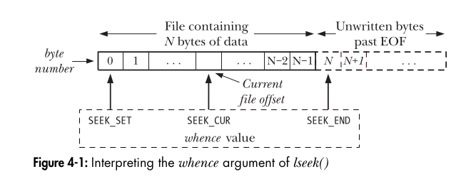

# Understanding `lseek()` in Unix-like Systems

## What is `lseek()`?

`lseek()` is a system call in Unix-like operating systems that allows you to change the file offset (also called the file pointer) of an open file descriptor. This offset determines the position in the file from which the next read or write operation will take place.

### Function Prototype:

```c
#include <unistd.h>
#include <fcntl.h>

off_t lseek(int fd, off_t offset, int whence);
```

### Parameters:

- `fd`: The file descriptor of the file.
- `offset`: The number of bytes to move the file offset.
- `whence`: Specifies how the offset should be interpreted. It can take one of the following values:
  - `SEEK_SET`: Sets the offset to `offset` bytes from the beginning of the file.
  - `SEEK_CUR`: Moves the offset by `offset` bytes from the current position.
  - `SEEK_END`: Moves the offset by `offset` bytes from the end of the file.



### Return Value:

- On success, `lseek()` returns the new file offset.
- On failure, it returns `-1` and sets `errno` appropriately.

---

## Examples

### 1. Moving the File Offset to the Beginning of the File

```c
#include <stdio.h>
#include <fcntl.h>
#include <unistd.h>

int main() {
    int fd = open("example.txt", O_RDONLY);
    if (fd == -1) {
        perror("open");
        return 1;
    }
    
    // Move the offset to the beginning
    if (lseek(fd, 0, SEEK_SET) == -1) {
        perror("lseek");
        close(fd);
        return 1;
    }
    
    printf("File offset set to beginning.\n");
    close(fd);
    return 0;
}
```

**Use case**: Resetting the file pointer before reading a file again.

---

### 2. Moving the Offset 10 Bytes Forward from the Current Position

```c
#include <stdio.h>
#include <fcntl.h>
#include <unistd.h>

int main() {
    int fd = open("example.txt", O_RDONLY);
    if (fd == -1) {
        perror("open");
        return 1;
    }
    
    // Move the offset forward by 10 bytes
    off_t new_offset = lseek(fd, 10, SEEK_CUR);
    if (new_offset == -1) {
        perror("lseek");
        close(fd);
        return 1;
    }
    
    printf("New file offset: %ld\n", new_offset);
    close(fd);
    return 0;
}
```

**Use case**: Skipping the first few bytes when reading structured binary data.

---

### 3. Moving the Offset to the End of the File

```c
#include <stdio.h>
#include <fcntl.h>
#include <unistd.h>

int main() {
    int fd = open("example.txt", O_RDONLY);
    if (fd == -1) {
        perror("open");
        return 1;
    }
    
    // Move the offset to the end of the file
    off_t file_size = lseek(fd, 0, SEEK_END);
    if (file_size == -1) {
        perror("lseek");
        close(fd);
        return 1;
    }
    
    printf("File size: %ld bytes\n", file_size);
    close(fd);
    return 0;
}
```

**Use case**: Determining the size of a file without reading it.

---

### 4. Appending Data to a File Using `lseek()`

```c
#include <stdio.h>
#include <fcntl.h>
#include <unistd.h>
#include <string.h>

int main() {
    int fd = open("example.txt", O_WRONLY | O_APPEND);
    if (fd == -1) {
        perror("open");
        return 1;
    }
    
    // Move the offset to the end of the file manually (not needed with O_APPEND)
    if (lseek(fd, 0, SEEK_END) == -1) {
        perror("lseek");
        close(fd);
        return 1;
    }
    
    char *data = "Appending new data.\n";
    write(fd, data, strlen(data));
    
    printf("Data appended successfully.\n");
    close(fd);
    return 0;
}
```

**Use case**: Ensuring data is appended to a file even if `O_APPEND` is not used.

---

### 5. Creating a Sparse File (File Holes)

A sparse file is a file with unallocated space (holes) that does not consume actual disk storage until data is written.

```c
#include <stdio.h>
#include <fcntl.h>
#include <unistd.h>

int main() {
    int fd = open("sparse_file.txt", O_WRONLY | O_CREAT, 0644);
    if (fd == -1) {
        perror("open");
        return 1;
    }
    
    // Write "Hello" at the beginning
    write(fd, "Hello", 5);
    
    // Move 1MB ahead (creating a hole)
    lseek(fd, 1024 * 1024, SEEK_CUR);
    
    // Write "World" after the hole
    write(fd, "World", 5);
    
    printf("Sparse file created.\n");
    close(fd);
    return 0;
}
```

**How it works**:
- **Logical file size** = **1MB + 10 bytes** (because we moved forward).
- **Actual disk space used** = **Only a few KB!** (because the 1MB gap is a file hole).

**Checking the file size vs. actual storage:**
```sh
ls -lh sparse_file.txt  # Shows large file size

du -h sparse_file.txt   # Shows actual disk usage (much smaller)
```

**Use case**: Efficiently storing large files with gaps (e.g., virtual disk images, databases).

---

## Summary

- `lseek()` changes the file offset for subsequent `read()` or `write()` operations.
- It allows efficient file navigation without reading/writing unnecessary data.
- Used for file manipulation, seeking within large files, and creating **sparse files (file holes)**.

### Common Errors and Debugging

- `EBADF`: File descriptor is invalid or not open.
- `EINVAL`: Invalid `whence` argument or seeking beyond allowable limits.
- `ESPIPE`: Attempted to use `lseek()` on a pipe, socket, or FIFO (not supported).

By mastering `lseek()`, you can optimize file handling and implement advanced techniques like **sparse files and manual file appending**. 🚀

