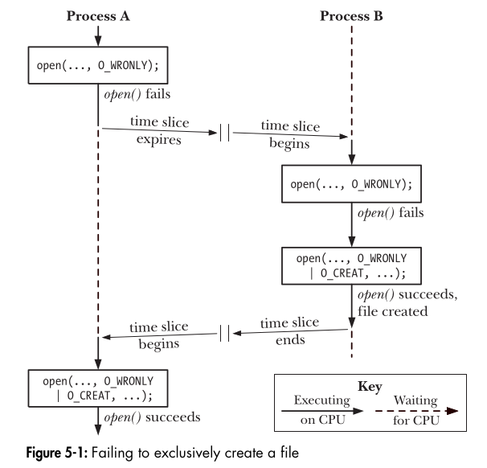

# **Atomicity and Race Conditions**  
### 🔹 **Breaking It Down into Simple Chunks**  

## **1️⃣ What is Atomicity?**
- **Definition**:  
  A system call is **atomic** when all its steps happen as **one uninterrupted operation**.  
- **Why is it important?**  
  - It ensures **data consistency** (prevents partial changes).  
  - Prevents **unexpected behaviors** when multiple processes work on the same data.  
- **Example**:  
  - Imagine a bank transfer:  
    - Deduct $500 from Account A  
    - Add $500 to Account B  
    - If the process is interrupted in the middle, money could vanish!  
    - **Atomic operations prevent this by ensuring everything happens as one step.**  

---

## **2️⃣ What is a Race Condition?**
- **Definition**:  
  A race condition happens when multiple processes **access or modify shared data** and the final result depends on **which process runs first**.  
- **Why is it bad?**  
  - It leads to **inconsistent data**, **unexpected bugs**, and **security risks**.  
- **Real-World Example:**  
  - **Two users buying the last train ticket online**  
    - Both users check availability at the same time → see **one ticket left**  
    - Both click "Buy" at the same time  
    - Both payments process at the same time  
    - **Only one should get the ticket, but without atomicity, both might get it!**  

---

## **3️⃣ Example 1: Creating a File Exclusively**  
Imagine two processes (A and B) trying to create the same file at the same time.  

### **🚨 Incorrect Code (Prone to Race Condition)**  
```c
#include <stdio.h>
#include <stdlib.h>
#include <fcntl.h>
#include <unistd.h>
#include <errno.h>

int main(int argc, char *argv[]) {
    if (argc != 2) {
        printf("Usage: %s <filename>\n", argv[0]);
        exit(EXIT_FAILURE);
    }

    int fd = open(argv[1], O_WRONLY);
    if (fd != -1) {
        printf("[PID %ld] File \"%s\" already exists\n", (long) getpid(), argv[1]);
        close(fd);
    } else {
        if (errno != ENOENT) {
            perror("open");
            exit(EXIT_FAILURE);
        }

        sleep(5);  // Artificial delay to increase chances of race condition

        fd = open(argv[1], O_WRONLY | O_CREAT, S_IRUSR | S_IWUSR);
        if (fd == -1) {
            perror("open");
            exit(EXIT_FAILURE);
        }

        printf("[PID %ld] Created file \"%s\" exclusively\n", (long) getpid(), argv[1]);
        close(fd);
    }

    return 0;
}
```
### **❌ What’s Wrong?**
1. **Two processes can enter the second `open()` call at the same time**.
2. **Process A checks if the file exists → No file found**
3. **Before Process A creates the file, Process B also checks → No file found**
4. **Both create the file and think they were first → Race Condition!**  

### **✅ Correct Code Using `O_EXCL` (Fixing the Race Condition)**
```c
fd = open(argv[1], O_WRONLY | O_CREAT | O_EXCL, S_IRUSR | S_IWUSR);
if (fd == -1) {
    perror("open");
    exit(EXIT_FAILURE);
}
printf("[PID %ld] Successfully created file \"%s\" exclusively\n", (long) getpid(), argv[1]);
close(fd);
```
**✅ Why is this correct?**  
- `O_EXCL` ensures that **if the file exists, `open()` fails immediately**.  
- The file creation happens in **one atomic step**, preventing other processes from interfering.  

---

---

---

## **4️⃣ Example 2: Appending Data to a File**  
Multiple processes trying to write logs at the same time.  

### **🚨 Incorrect Code (Race Condition)**
```c
lseek(fd, 0, SEEK_END);  // Move to end of file
write(fd, buf, len);      // Write new data
```
### **❌ What’s Wrong?**
- **Process A moves to the end of the file**  
- **Before Process A writes, Process B moves to the end of the file**  
- **Now, both write at the same position, overwriting each other’s data!**  

### **✅ Correct Code Using `O_APPEND` (Fixing the Race Condition)**
```c
fd = open("logfile.txt", O_WRONLY | O_APPEND);
write(fd, buf, len);
```
**✅ Why is this correct?**  
- `O_APPEND` makes `write()` **atomic**, so each process **writes at the correct position** without interfering.  

---

## **5️⃣ Lasting Summary 🧠**  

### **🌟 Key Takeaways**  
| Concept          | Definition |
|-----------------|------------|
| **Atomicity**   | A system call that happens **completely or not at all**, without interruption. |
| **Race Condition** | A situation where the result depends on **which process runs first**. |
| **O_EXCL (Exclusive Create)** | Ensures **only one process can create a file** at a time. |
| **O_APPEND (Safe File Appending)** | Ensures **multiple processes don’t overwrite each other’s writes**. |

---

### **🎯 Final Thought**  
Understanding **atomicity and race conditions** is **critical** when writing multi-process applications.  
Without atomic operations, systems can have **data corruption, lost updates, and unexpected behavior**.  

✅ Always use **`O_EXCL`** for exclusive file creation.  
✅ Always use **`O_APPEND`** when multiple processes append data to a file.  

By following these principles, you can **write safe, bug-free concurrent applications**! 🚀  

---

This breakdown ensures that even someone new to the topic can understand **why atomicity matters**, how **race conditions occur**, and how to **fix them** with proper system calls. Let me know if you'd like further simplifications! 🚀🔥