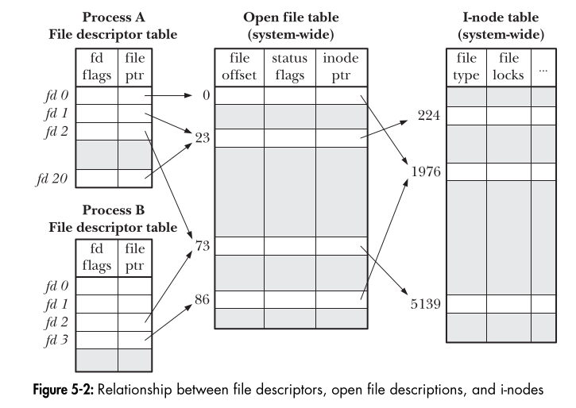

# 🔥 Understanding File Descriptors & `close-on-exec`

## 📌 What Happens When You Open a File?
When a process calls:
```c
int fd = open("file.txt", O_RDONLY);
```
The kernel performs the following steps:

### 🔹 **Step 1: Allocate a File Descriptor (FD)**
- The **File Descriptor Table** (specific to the process) is checked for an available slot.
- The lowest available FD (e.g., `3`) is assigned to the opened file.
- **Important:** The FD is just an **index** in the process's File Descriptor Table.

### 🔹 **Step 2: Create an Entry in the Open File Table**
- The kernel creates an **Open File Description** in the **System-wide Open File Table**, which includes:
  - **File offset** (position for reading/writing)
  - **Open mode** (`O_RDONLY`, `O_WRONLY`, `O_RDWR`)
  - **Flags** (`O_APPEND`, `O_NONBLOCK`, etc.)
  - **Reference to the i-Node Table** (which stores actual file data)

- **The FD now points to this Open File Table entry, NOT the actual file.**

### 🔹 **Step 3: Link the Open File Table Entry to the i-Node Table**
- The **Open File Table entry** is linked to the **i-Node Table**, which contains:
  - **File type** (regular file, directory, socket, FIFO, etc.)
  - **File permissions**
  - **Timestamps** (created, modified, accessed)

## 🔥 **What is `close-on-exec`?**

### 🌍 **Real-World Example**
Imagine you're a chef in a restaurant taking orders:
- The waiter (FD) tells you **Table 3 ordered Pasta**.
- Suddenly, the **restaurant changes ownership** (similar to executing a new program).
- Should you **clear out old orders** or **continue processing them**?

This is exactly what `close-on-exec` controls!

### 🛠 **Technical Explanation**
Every **File Descriptor Table entry** has a **close-on-exec flag**:
- If **enabled** (`FD_CLOEXEC`), the FD **automatically closes** when the process calls `exec()`.
- If **disabled**, the FD **remains open** across `exec()`.

### 🔹 **Why Does This Matter?**
- When a process calls `exec()`, it **replaces itself** with a new program.
- If it keeps **inherited FDs**, they might be **leaked** to the new program.
- This is a **security risk** if the FDs point to sensitive files or sockets.

### 📝 **Example in Code**
```c
int fd = open("secret.txt", O_RDONLY);
fcntl(fd, F_SETFD, FD_CLOEXEC);
execl("/bin/ls", "ls", NULL);
```
🔹 **What happens?**
- The file `secret.txt` is opened.
- `fcntl()` sets `FD_CLOEXEC` on `fd`.
- When `execl()` runs, the new program (`ls`) **does NOT inherit `fd`**.

## 📌 **How `close-on-exec` Fits Into the Whole Flow?**

| **Component**                     | **What it Stores**                                             | **Extra Information**                          |
|------------------------------------|-------------------------------------------------------------|----------------------------------------------|
| **File Descriptor Table** (Per Process) | ✔ FD (Index) → Open File Table Entry                      | Has a **close-on-exec flag** (`FD_CLOEXEC`) |
| **Open File Table** (System-wide)  | ✔ File offset<br>✔ Open mode (`O_RDONLY`, etc.)<br>✔ Flags | Shared between processes if forked         |
| **i-Node Table** (Filesystem)      | ✔ File type<br>✔ Permissions<br>✔ Metadata (timestamps)   | Represents actual file data                 |



## ✅ **Key Takeaways**
✔ **File Descriptors are just numbers indexing the Open File Table.**  
✔ **FDs don’t store file details directly; they only store an index.**  
✔ **The Open File Table contains real file info (offset, mode, flags, etc.).**  
✔ **If `FD_CLOEXEC` is set, the FD is closed when calling `exec()`.**  
✔ **If a process `fork()`s, the child inherits all FDs, but `exec()` can remove them.**  

---
This should give you a **clear and structured understanding**! 🚀

