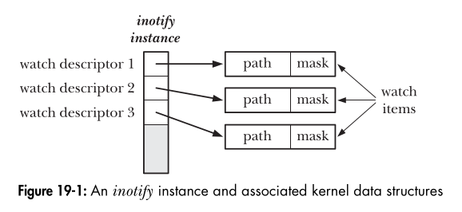

# inotify API (Final Simplified Notes)

The **inotify API** lets you monitor files and directories for changes in real time on Linux. It's like setting up a "watcher" that tells your program when something happens to your files.

---

## 1. Creating an inotify Instance

- **Function:**
  ```c
  #include <sys/inotify.h>
  int inotify_init(void);
  ```
- **What it does:** Creates a new inotify instance (your watcher system).
- **Returns:**
  - File descriptor (fd) on success (use this for all other inotify calls)
  - -1 on error

### Modern Version

- **Function:**
  ```c
  int inotify_init1(int flags);
  ```
- **Flags:**
  - `IN_CLOEXEC`: Auto-close on exec (for security)
  - `IN_NONBLOCK`: Non-blocking reads (no waiting)

---

## 2. Adding a Watch

- **Function:**
  ```c
  int inotify_add_watch(int fd, const char *pathname, uint32_t mask);
  ```
- **What it does:** Tells inotify to watch a file or directory for specific events (like create, modify, delete).
- **Parameters:**
  - `fd`: The inotify instance (from `inotify_init()`)
  - `pathname`: Path to the file or directory to watch (must have read permission at the time of call)
  - `mask`: Bitmask of events to monitor (e.g., `IN_MODIFY | IN_CREATE`)
- **Returns:**
  - Watch descriptor (wd) on success (a unique number for this watch)
  - -1 on error
- **Notes:**
  - If you add a watch for a path that's already being watched, it updates the mask and returns the same wd.
  - You keep getting notifications even if file permissions change later.

---



## 3. Removing a Watch

- **Function:**
  ```c
  int inotify_rm_watch(int fd, uint32_t wd);
  ```
- **What it does:** Removes a watch from the inotify instance.
- **Parameters:**
  - `fd`: The inotify instance
  - `wd`: The watch descriptor to remove
- **Returns:**
  - 0 on success
  - -1 on error
- **Note:**
  - Removing a watch generates an `IN_IGNORED` event.

---

## 4. How Event Reading Works (Step-by-Step)

When something happens to a watched file, the kernel writes one or more events into your buffer. Each event is a `struct inotify_event` (plus an optional name field).

### **Reading Events**

```c
char buf[4096];
int len = read(fd, buf, sizeof(buf)); // fd from inotify_init()
```

- `len` is the number of bytes filled with event data.

### **Processing Events in the Buffer**

```c
for (char *ptr = buf; ptr < buf + len; ptr += sizeof(struct inotify_event) + event->len) {
    struct inotify_event *event = (struct inotify_event *) ptr;
    // Use event->mask, event->name, etc.
}
```

#### **Why this works:**

- The buffer may contain multiple events, each with a variable-length name field.
- You start at the beginning (`ptr = buf`) and move forward by the size of each event (`sizeof(struct inotify_event) + event->len`).
- You stop when you reach the end of the valid data (`ptr < buf + len`).

### **Step-by-Step Example**

Suppose:

- Event 1: 32 bytes
- Event 2: 40 bytes
- Event 3: 28 bytes
- `len = 100`

| Address | 0   | ...    | 32  | ...    | 72  | ... | 100 |
| ------- | --- | ------ | --- | ------ | --- | --- | --- |
| Event 1 |     | Event2 |     | Event3 |     | END |

- First loop: `ptr = 0` (Event 1), move to `ptr = 32`
- Second loop: `ptr = 32` (Event 2), move to `ptr = 72`
- Third loop: `ptr = 72` (Event 3), move to `ptr = 100`
- Loop ends (`ptr == buf + len`)

---

## 5. Key Points & Best Practices

- **File permissions** are checked only when adding a watch.
- **Watches remain active** even if permissions change later.
- **Always remove watches** and close the inotify fd when done.
- **Process all events in the buffer**; don't go past `buf + len`.
- **Use appropriate buffer sizes** (4096 bytes is common).
- **Check return values** for all system calls.

---

## 6. Common Use Cases

- **Log monitoring**: Watch for new log entries.
- **Config reload**: Reload app config when a file changes.
- **File sync**: Sync files when they're modified.
- **Security**: Detect unauthorized file changes.

---

## 7. Minimal Example

```c
#include <sys/inotify.h>
#include <stdio.h>
#include <unistd.h>

int main() {
    int fd = inotify_init();
    int wd = inotify_add_watch(fd, "/tmp/test.txt", IN_MODIFY | IN_DELETE);
    char buf[4096];
    while (1) {
        int len = read(fd, buf, sizeof(buf));
        for (char *ptr = buf; ptr < buf + len; ptr += sizeof(struct inotify_event) + ((struct inotify_event *)ptr)->len) {
            struct inotify_event *event = (struct inotify_event *) ptr;
            if (event->mask & IN_MODIFY)
                printf("File modified!\n");
            if (event->mask & IN_DELETE)
                printf("File deleted!\n");
        }
    }
    inotify_rm_watch(fd, wd);
    close(fd);
    return 0;
}
```

---

**This covers all the key points, technical details, and the logic behind event reading in the inotify API.**
