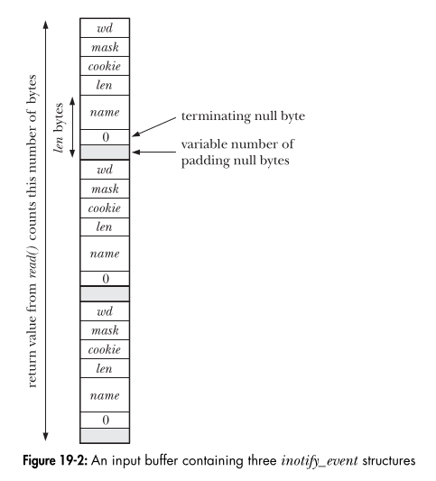

# 📖 **Reading inotify Events: Practical Notes**

## **1. The Event Structure**

When you read from an inotify file descriptor, you get a buffer containing one or more events, each described by:

```c
struct inotify_event {
    int      wd;       // Watch descriptor
    uint32_t mask;     // Event mask (what happened)
    uint32_t cookie;   // Used to link related events (e.g., rename)
    uint32_t len;      // Length of 'name' field
    char     name[];   // Name of file/dir (if any)
};
```

---



## **2. Reading and Processing Events**

- Use a buffer (e.g., 4096 bytes) to read events.
- Each read may return multiple events packed together.
- Use pointer arithmetic to step through each event in the buffer.

**Example:**
```c
char buffer[4096];
int len = read(fd, buffer, sizeof(buffer));
for (char *ptr = buffer; ptr < buffer + len; ) {
    struct inotify_event *event = (struct inotify_event *) ptr;
    // process event
    ptr += sizeof(struct inotify_event) + event->len;
}
```

---

## **3. Understanding the Fields**

| Field   | Meaning                        | Usage in event reading                      |
|---------|-------------------------------|---------------------------------------------|
| `wd`    | Watch descriptor              | Tells you which watched path the event is for |
| `mask`  | Event bitmask                 | Tells you what happened (see below)         |
| `cookie`| Links related events          | Used for rename/move events                 |
| `len`   | Length of `name` field        | How many bytes to skip for next event       |
| `name`  | File/dir name (if any)        | Name of entry inside watched dir, or empty  |

---

## **4. The `name` Field: When is it Set?**

- **If you watch a file:**  
  - `name` is always empty (`""`).
- **If you watch a directory:**  
  - `name` is set for events about entries inside the directory (e.g., file created/deleted/modified).
  - `name` is empty for events about the directory itself (e.g., directory deleted, moved, or attribute changed).

---

## **5. How to Check Which Event Occurred (`mask`)**

- `mask` is a bitmask; use bitwise AND (`&`) to check:
  ```c
  if (event->mask & IN_CREATE) { /* entry created inside dir */ }
  if (event->mask & IN_DELETE) { /* entry deleted inside dir */ }
  if (event->mask & IN_MODIFY) { /* entry modified inside dir */ }
  if (event->mask & IN_ATTRIB) { /* metadata changed (file or dir) */ }
  if (event->mask & IN_DELETE_SELF) { /* watched file/dir itself deleted */ }
  if (event->mask & IN_MOVE_SELF) { /* watched file/dir itself moved */ }
  ```

---

## **6. Example: Printing Event Info**

```c
for (char *ptr = buffer; ptr < buffer + len; ) {
    struct inotify_event *event = (struct inotify_event *) ptr;
    printf("wd=%d mask=%x len=%d name=%s\n",
           event->wd, event->mask, event->len,
           event->len ? event->name : "(none)");
    ptr += sizeof(struct inotify_event) + event->len;
}
```

---

## **7. Summary Table: `name` Field**

| You watch...      | Event for...         | `name` field      |
|-------------------|---------------------|-------------------|
| A file            | The file itself      | Empty (`""`)      |
| A directory       | Entry inside it      | Name of entry     |
| A directory       | Directory itself     | Empty (`""`)      |

---
