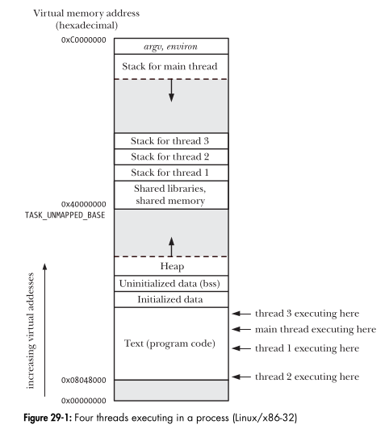

### **🔹 Beginner-Friendly Breakdown of Threads**  

## **1️⃣ What Are Threads?**  
📌 **Definition:**  
A **thread** is a lightweight execution unit within a process. Unlike processes, multiple threads inside a process share the same memory and resources.  

💡 **Example:**  
Think of a **web browser**:  
- One **thread** loads a webpage,  
- Another thread **downloads images**,  
- Another **handles user interactions**.  

All these threads share the same memory but execute different tasks simultaneously.  

---

## **2️⃣ How Are Threads Different from Processes?**  
| Feature       | Threads (`pthread.h`) | Processes (`fork()`) |
|--------------|------------------|----------------|
| **Memory**   | Shared          | Separate       |
| **Creation Speed** | Fast (uses `clone()`) | Slow (uses `fork()`) |
| **Data Sharing**  | Easy (global & heap) | Hard (requires IPC) |
| **Isolation** | Low (can affect others) | High (independent) |

📌 **Key Takeaway:**  
- **Threads are faster and share memory**, making them great for parallel tasks.  
- **Processes are slower but isolated**, making them safer for critical operations.  

---

## **3️⃣ What Threads Share vs. What They Don’t**  

### **🔹 Threads Share (Global to All Threads)**  
✅ **Memory Segments:**  
- **Code (Text)**
- **Initialized & Uninitialized Data**
- **Heap (Dynamic Memory Allocation)**  

✅ **Other Shared Attributes:**  
- **Process ID & Parent Process ID**  
- **Open File Descriptors** (e.g., shared files)  
- **Current Working Directory**  
- **Resource Limits** (e.g., CPU time)  
- **Signal Handlers**  

💡 **Example:** If one thread opens a file, all threads can access it.

---

### **🔹 Threads Have Their Own (Unique to Each Thread)**  
✅ **Each Thread Has:**  
- **Thread ID (TID)**  
- **Stack (Local Variables, Function Calls)**  
- **Signal Mask** (Which signals it blocks)  
- **Floating-Point Environment**  
- **CPU Scheduling Policy & Priority**  

💡 **Example:** If one thread modifies a local variable, it doesn’t affect other threads.  

---

## **4️⃣ Why Use Threads Instead of Processes?**  
🔹 **Problem with Processes:**  
1. **Hard to share data** → Requires IPC (pipes, message queues).  
2. **Slow creation** → `fork()` duplicates memory & resources.  

🔹 **Threads Solve This By:**  
✅ **Easier Data Sharing** → Threads use shared memory.  
✅ **Faster Creation** → Threads use `clone()`, which avoids duplicating memory.  

💡 **Example:** A **multithreaded web server** can handle multiple clients using threads instead of forking a new process for each request.  

---

---

## **5️⃣ The Danger of Sharing Memory**  
📌 **Threads can modify shared memory, leading to race conditions.**  

💡 **Example:**  
1. **Thread A** reads a variable `x = 5`.  
2. **Thread B** modifies `x = 10`.  
3. **Thread A** is still working with the old value (`x = 5`), leading to incorrect results.  

✅ **Solution:** Use **synchronization mechanisms** (covered in Chapter 30).  

---

### **📌 Summary**  
- **Threads run inside a process, sharing memory but executing independently.**  
- **Threads are faster than processes** and useful for multitasking (e.g., web servers, games).  
- **Threads share global memory, file descriptors, and process attributes** but have their own stack and thread ID.  
- **Threads are powerful but require synchronization** to avoid memory conflicts.  
