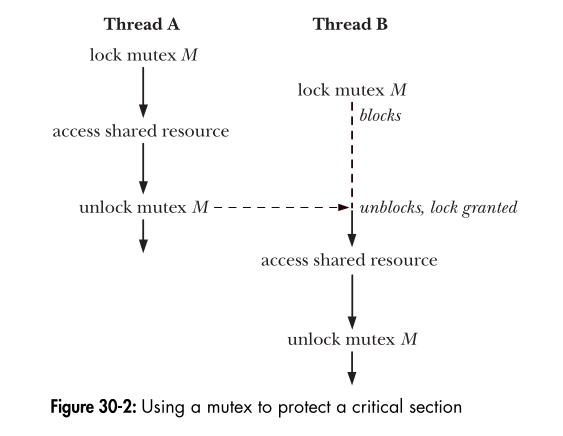

### **Introduction to Mutexes**  

#### **🔹 Why Do We Need Mutexes?**  
- One of the biggest advantages of **threads** is that they can **share global variables**.  
- However, this creates a **problem**:  
  - If multiple threads try to **modify** the same variable at the same time, they might interfere with each other.  
  - If one thread is **reading** a variable while another is **modifying** it, it might get the wrong value.  

---

#### **🔹 What Is a Critical Section?**  
- A **critical section** is a piece of code that **accesses a shared resource** (e.g., a global variable).  
- To prevent errors, a **critical section must be executed atomically**, meaning that it **should not be interrupted** by other threads.  

---

#### **🔹 Example: What Happens Without a Mutex?**  
The book provides an example program that creates **two threads**.  
Each thread **increments** a global variable `glob` in a loop:  

```c
static int glob = 0;

static void *threadFunc(void *arg) {
    int loops = *((int *) arg);
    int loc, j;
    for (j = 0; j < loops; j++) {
        loc = glob;  // Read global variable
        loc++;       // Increment it
        glob = loc;  // Write it back
    }
    return NULL;
}
```

🔹 **What goes wrong?**  
- If we run this with **small values**, we might get the correct result:  
  ```sh
  $ ./thread_incr 1000
  glob = 2000
  ```  
- But when we use **larger values**, the final result is incorrect:  
  ```sh
  $ ./thread_incr 10000000
  glob = 16517656  # Expected: 20,000,000
  ```
- This happens because the two threads **interfere with each other**, leading to **data corruption**.  

🔹 **Why does this happen?**  
- **Thread 1 reads `glob`** and stores it in `loc` (say, `glob = 2000`).  
- Before it updates `glob`, **Thread 2 runs and modifies `glob`** (say, now `glob = 3000`).  
- When **Thread 1 resumes**, it **overwrites `glob` with its old value +1 (`glob = 2001`)**, **ignoring the changes made by Thread 2**.  
- This is called a **race condition**, meaning the result depends on the **timing of thread execution**.  

---

#### **🔹 Can We Fix It by Using `glob++` Instead?**  
- We might think of replacing:  
  ```c
  loc = glob;
  loc++;
  glob = loc;
  ```
  with:  
  ```c
  glob++;
  ```
- **But even this is not safe!**  
  - Even though `glob++` looks like a single operation, it **actually consists of three steps** at the machine level:
    1. Read `glob`
    2. Increment `glob`
    3. Store the new value of `glob`
  - If a thread **gets interrupted between these steps**, the problem remains.  

---

#### **🔹 How Do Mutexes Solve This?**  
- A **mutex (mutual exclusion lock)** ensures that only **one thread at a time** can modify the shared variable.  
- A **mutex can be either:**
  1. **Locked (in use by a thread)**
  2. **Unlocked (available for use)**  
- If a thread tries to **lock an already locked mutex**, it **must wait**.  
- Only the thread that locked a mutex **can unlock it**.  

---



#### **🔹 How Do We Use Mutexes?**  
Every thread must follow these **three steps**:  

1. **Lock the mutex** before accessing the shared resource.  
2. **Access the resource** safely.  
3. **Unlock the mutex** when done.  

This ensures that **only one thread at a time** enters the critical section.  

---

#### **🔹 Mutex Locking Is Advisory**  
- **Threads must voluntarily follow mutex rules**.  
- If a thread **ignores the mutex** and modifies shared data without locking it, problems will still occur.  
- **All threads must cooperate** to ensure correct behavior.  

---

### **🔹 Key Takeaways**
✅ **Without a mutex, shared variables can be corrupted due to race conditions.**  
✅ **Even simple-looking operations like `glob++` are not atomic!**  
✅ **A mutex ensures that only one thread accesses a critical section at a time.**  
✅ **Mutex locking must be followed by all threads for it to work properly.**  
