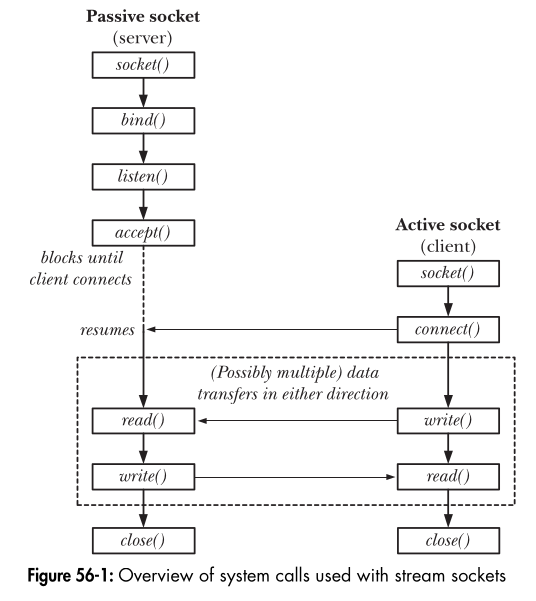

## **Stream Sockets Overview**
Stream sockets (`SOCK_STREAM`) provide **reliable, connection-oriented communication** using **TCP (Transmission Control Protocol)**. They ensure **ordered, error-free, and full-duplex data transmission**.

---

### **Analogy: Telephone System**
A stream socket connection is like making a **telephone call**, where both parties must be available and connected before communication starts.

#### **1. Creating a Socket → Installing a Telephone**
- Both the client and server must create a socket using `socket()`, just like both people in a call must have a phone.

#### **2. Establishing a Connection → Making a Phone Call**
- The **server** prepares to receive calls:
  - Calls `bind()` to assign an address (like having a phone number).
  - Calls `listen()` to indicate it is ready to accept calls (like turning on the phone).
- The **client** initiates a call:
  - Calls `connect()` to reach the server’s socket (like dialing a phone number).
- The **server accepts the call**:
  - Calls `accept()` to handle incoming client requests (like picking up the phone).

#### **3. Data Transmission → Two-Way Conversation**
- Once connected, both parties can send and receive data using:
  - `send()` and `recv()` (socket-specific system calls)
  - `read()` and `write()` (generic system calls)

#### **4. Closing the Connection → Hanging Up**
- When communication is complete, either side can call `close()` to terminate the connection (like hanging up the phone).

---

### **Active vs. Passive Sockets**
**1. Active Socket (Client)**
- Default type after calling `socket()`.
- Can **initiate a connection** using `connect()`.
- This action is called **active open**.

**2. Passive Socket (Server)**
- A socket that calls `listen()` to **wait for incoming connections**.
- Accepts connections using `accept()`.
- This action is called **passive open**.

💡 **Key Takeaway**: In most applications, the **client performs the active open (connect), and the server performs the passive open (listen & accept)**.

