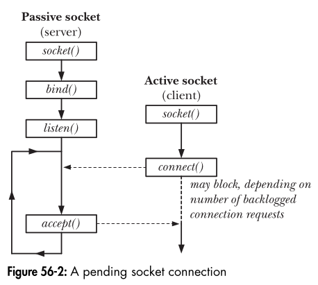

### **Understanding `listen()` in Stream Sockets**
The `listen()` system call is used **only on server-side sockets** to mark them as **passive**, meaning they are ready to accept incoming connections.  

📌 **Key Concept:**  
Before a server can accept client connections, it must explicitly state that it is willing to receive them. This is achieved using `listen()`, which tells the kernel to queue up connection requests from clients.  

---

### **Real-World Analogy: Waiting Room in a Restaurant**
Imagine a **restaurant with a waiting area**:
1. The restaurant (server) is **not open** to customers yet.
2. It **opens** for service (`listen()`), and a waiting queue is established.
3. Customers (clients) start arriving and wait for a table (`connect()`).
4. The restaurant allows a certain number of people in the waiting area (`backlog`).
5. When a table is free, the host accepts the next customer (`accept()`).
6. If the waiting area is full, new customers must **wait or retry later**.

---



### **Breaking Down the `listen()` System Call**
```c
#include <sys/socket.h>
int listen(int sockfd, int backlog);
```
- **`sockfd`** → The socket file descriptor.
- **`backlog`** → The maximum number of pending connections before new ones are blocked.
- **Return Value**:  
  - `0` → Success  
  - `-1` → Error  

---

### **How `listen()` Works**
1. The **server socket** is created with `socket()`.
2. It is bound to an address and port using `bind()`.
3. The `listen()` call **activates the queue** for handling pending connections.
4. Clients can now call `connect()`, and their requests are placed in the **backlog queue**.
5. The server calls `accept()` to process one pending connection at a time.

---

### **The Role of `backlog` (Queue for Pending Connections)**
When multiple clients request a connection **before the server is ready to accept them**, the **backlog** determines how many such pending connections can be stored before new ones are rejected or delayed.

📌 **What happens if the backlog is exceeded?**
- New client connection attempts **pause** until an existing pending connection is accepted.
- If the backlog queue is full and more connections arrive, clients might receive a **connection refused** error.

🔹 **Real-World Example**:  
Think of a **call center with 10 phone lines**:
- If all 10 lines are busy, the 11th caller gets a busy signal.
- If an operator answers a call (`accept()`), one line becomes free for new callers.

---

### **System-Specific Limits on `backlog`**
- The backlog value is **not always directly applied** as given.  
- **POSIX Systems** allow rounding down to a system-defined maximum (e.g., `SOMAXCONN`).
- **Linux Default (`/proc/sys/net/core/somaxconn`)**:
  - Older kernels (`< 2.4.25`) → Fixed backlog limit **128**.
  - Newer kernels → Configurable at runtime (`/proc/sys/net/core/somaxconn`).
  
📌 **Older BSD Implementation**:  
- The backlog limit was **hardcoded to 5** in early BSD systems.
- Modern network servers need higher limits to handle large-scale client traffic.

---

### **How TCP and Backlog Work (Simple Perspective)**  

Imagine you're running a **ticket counter at a movie theater**.  
- Customers arrive and **ask for a ticket** (client sends a connection request).  
- The staff checks if **seats are available** and gives a confirmation.  
- If confirmed, the customer **enters the theater** and gets a seat (connection is fully established).  

In **TCP**, this happens in **two stages**:  
1. **SYN Queue (Waiting List)** → Customers waiting to get a confirmed ticket.  
2. **Accept Queue (Theater Seating)** → Customers who have their tickets and are waiting for a seat.  

---

### **What Happens in the OS?**  
When a client wants to connect:  
1. **SYN Queue (Half-Open Connections)**  
   - When a client sends a **connection request (`SYN`)**, the OS **temporarily stores it in the SYN queue**.  
   - The server hasn't confirmed yet, so it's like being on a "waiting list."  

2. **Accept Queue (Confirmed Connections Waiting for Service)**  
   - When the server acknowledges the client (`SYN-ACK`), and the client responds (`ACK`), the connection moves to the **accept queue**.  
   - This queue is controlled by the `backlog` value in `listen()`.  
   - Think of it as customers who now have a ticket and are waiting to be assigned a seat.  

---

### **Why Does Backlog Matter?**  
- If **backlog is too small**, new customers **can’t get in**, and they are **rejected** (dropped connections).  
- If backlog is **large**, the server can **handle more pending connections** before processing them.  

🔹 **Example in OS Context:**  
- A **busy web server** (like Apache or Nginx) might handle **thousands of users** per second.  
- If `backlog` is set too **low**, many incoming users **won’t get a response** and will see connection failures.  
- High-performance servers **tune this setting** to ensure they **don’t drop connections unnecessarily**.  

---

### **Key Takeaways**
✅ **SYN Queue** → Holds "waiting" connection requests (clients who haven’t received confirmation).  
✅ **Accept Queue** → Holds "confirmed" connections (clients ready for service).  
✅ **Backlog controls the accept queue**, NOT the SYN queue.  
✅ **Tuning backlog settings** is critical for **high-traffic servers** (websites, game servers, etc.).  
✅ `listen()` is **only for server sockets** and prepares them for incoming connections.  
✅ The `backlog` value determines **how many connections can wait before being processed**.  
✅ If the backlog is full, new connections may be **delayed or dropped**.  
✅ **OS-level limits (SOMAXCONN)** determine the actual backlog capacity.  
✅ **Network servers require careful tuning** of `listen()` and `backlog` for optimal performance.  
