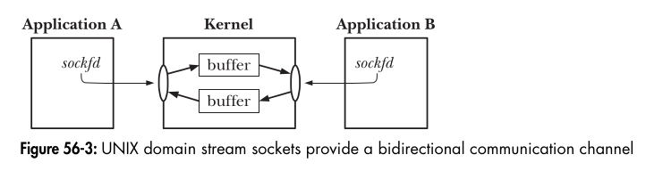

### **Breaking Down Bidirectional Communication in Sockets (Simplified)**  

Let’s make this super simple!  

---

### **Think of a Phone Call Again 📞**  
- You and a friend are **on a call**.  
- Both of you can **speak** and **listen** → **Bidirectional communication**.  
- If one person **hangs up**, the other hears silence → The connection is **closed**.

---

### **How This Works in UNIX Sockets**  
When two sockets are **connected**, they form a **two-way communication channel** (like a phone line).  
- **Both sockets can send and receive data**.  
- **We use `read()` and `write()` (or `send()` and `recv()`) to exchange messages**.

---

### **What Happens When a Socket Closes?**  

#### **1️⃣ If a Socket is Closed (`close()`)**  
- The **other side detects EOF (End-of-File)** when trying to `read()`.  
- If there’s **buffered data**, it can still be read.  

#### **2️⃣ What If The Peer Tries to Write After The Connection Closes?**  
- **OS sends a `SIGPIPE` signal**.  
- The `write()` call **fails with an `EPIPE` error**.  
- This means: **"You're writing to a closed connection!"** 🚫  

#### **3️⃣ How to Handle This?**  
✅ **Ignore `SIGPIPE`** → This prevents the program from crashing.  
✅ **Check for `EPIPE` error** → It tells you the connection is gone.

---

### **Key Takeaways 🚀**  
1️⃣ **Sockets work like phone calls** – both sides can send and receive data.  
2️⃣ **If a socket closes**, the other side gets EOF on `read()`.  
3️⃣ **If you write to a closed socket**, you get a `SIGPIPE` signal and `EPIPE` error.  
4️⃣ **Solution** → Ignore `SIGPIPE` and handle `EPIPE` properly.  
