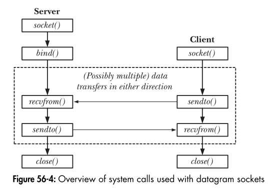

# Datagram Sockets: A Simple and Detailed Explanation

## 1. Introduction to Datagram Sockets

Datagram sockets provide a **connectionless** method of communication over a network. Unlike stream sockets (TCP), datagram sockets (UDP) do not establish a persistent connection between sender and receiver. Instead, each message (datagram) is sent independently, like mailing letters.

### Real-World Analogy: Postal System
Imagine you are sending postcards to a friend. Each postcard:
- Is **sent independently** (no established connection like a phone call).
- Might **arrive out of order** or get **lost in transit**.
- Does not require a direct connection to the recipient.
- Includes **both sender and recipient addresses** so the recipient knows where to reply.

This is exactly how UDP-based **datagram sockets** work.

---
## 2. Key Features of Datagram Sockets

1. **Connectionless Communication**  
   - No need to establish a connection before sending data.
   - Each packet is treated independently.

2. **Unreliable but Fast**  
   - Packets **may be lost, duplicated, or arrive out of order**.
   - No automatic retransmission like TCP.
   - Useful for real-time applications (video streaming, gaming).

3. **Datagrams Are Self-Contained**  
   - Each datagram includes **both the sender and receiver's address**.
   - This allows communication with multiple peers.

---
## 3. Essential System Calls for Datagram Sockets

| Function | Purpose |
|----------|---------|
| `socket()` | Creates a socket |
| `bind()` | Assigns an address to the socket (mainly for servers) |
| `sendto()` | Sends a datagram to a specific address |
| `recvfrom()` | Receives a datagram and retrieves sender information |
| `connect()` | Optionally binds a socket to a peer for simpler I/O |
| `close()` | Closes the socket |

---



## 4. Steps to Use Datagram Sockets

### **Step 1: Create a Socket**
```c
int sockfd = socket(AF_INET, SOCK_DGRAM, 0);
```
This creates a UDP socket.

### **Step 2: Bind the Socket (For Servers)**
```c
struct sockaddr_in server_addr;
server_addr.sin_family = AF_INET;
server_addr.sin_port = htons(8080);
server_addr.sin_addr.s_addr = INADDR_ANY;

bind(sockfd, (struct sockaddr*)&server_addr, sizeof(server_addr));
```
Servers bind to a well-known address so clients can send data to them.

### **Step 3: Send Data (Using `sendto()`)**
```c
char message[] = "Hello, Client!";
struct sockaddr_in client_addr;
client_addr.sin_family = AF_INET;
client_addr.sin_port = htons(9000);
inet_pton(AF_INET, "192.168.1.100", &client_addr.sin_addr);

sendto(sockfd, message, strlen(message), 0, (struct sockaddr*)&client_addr, sizeof(client_addr));
```
Each `sendto()` call requires the recipient’s address, just like writing a letter.

### **Step 4: Receive Data (Using `recvfrom()`)**
```c
char buffer[1024];
struct sockaddr_in sender_addr;
socklen_t addr_len = sizeof(sender_addr);

recvfrom(sockfd, buffer, sizeof(buffer), 0, (struct sockaddr*)&sender_addr, &addr_len);
printf("Received: %s\n", buffer);
```
`recvfrom()` retrieves the sender’s address, allowing a response to be sent.

### **Step 5: Close the Socket**
```c
close(sockfd);
```

---
## **Using `connect()` with UDP: A Deep Dive 🚀**  

UDP is **connectionless**, meaning each `sendto()` and `recvfrom()` requires specifying the destination and handling incoming packets from any source. However, calling `connect()` on a **UDP socket** can simplify things when you’re communicating with just **one peer**. Let's explore **how `connect()` changes UDP behavior** and how it affects `recvfrom()`.

---

### **🔹 What Happens When We Call `connect()` on a UDP Socket?**
Even though UDP **does not** establish an actual connection like TCP, calling `connect()` on a UDP socket does two things:  

1️⃣ **Locks the socket to a single peer** (IP + Port).  
2️⃣ **Allows using `send()` and `recv()` instead of `sendto()` and `recvfrom()`**, making the code simpler.

---

### **🔹 Behavior of `recvfrom()` After `connect()`**
After calling `connect()`, the kernel **ignores** the `client_addr` and `addr_len` in `recvfrom()`.  

- ✅ **The data is still received** and stored in the buffer.  
- ❌ **The `client_addr` structure is NOT updated** (because the socket is locked to one peer).  

### **📌 Example Without `connect()` (Traditional UDP)**
```c
ssize_t received_bytes = recvfrom(sfd, buffer, BUFFER_SIZE, 0, 
                                  (struct sockaddr *)&client_addr, &addr_len);
```
- Here, **`client_addr` gets updated** with the sender’s address on every call.  
- This is useful when handling multiple clients.  

### **📌 Example With `connect()` (Simplified UDP)**
```c
connect(sfd, (struct sockaddr *)&client_addr, addr_len);

ssize_t received_bytes = recvfrom(sfd, buffer, BUFFER_SIZE, 0, 
                                  (struct sockaddr *)&client_addr, &addr_len);
```
- ✅ `buffer` will still receive data.  
- ❌ `client_addr` and `addr_len` **remain unchanged** (kernel does not update them).  

### **✅ Correct Alternative After `connect()`**
Once `connect()` is used, simply call:
```c
ssize_t received_bytes = recv(sfd, buffer, BUFFER_SIZE, 0);
```
- No need to use `recvfrom()`, as the socket is **already linked** to one peer.  
- This reduces complexity and avoids unnecessary arguments.

---

## **🔹 Why Would You Use `connect()` on a UDP Socket?**
### **✅ When It's Useful:**
- You **only communicate with one server or client**.
- You **want simpler code** (no need for `sendto()` and `recvfrom()`).
- The socket **can still receive ICMP errors** (e.g., "Destination Unreachable" messages).

### **❌ When You Should NOT Use `connect()` on UDP:**
- If you need to **handle multiple clients** dynamically.  
- If the socket should accept messages from **anyone**.  

---

## **🔹 Real-World Example**
### **📌 Without `connect()` (Multi-Client UDP Server)**
Imagine a UDP server receiving requests from multiple clients:
```c
struct sockaddr_in client_addr;
socklen_t addr_len = sizeof(client_addr);

ssize_t received_bytes = recvfrom(sfd, buffer, BUFFER_SIZE, 0, 
                                  (struct sockaddr *)&client_addr, &addr_len);
printf("Received from client %s:%d\n", 
        inet_ntoa(client_addr.sin_addr), ntohs(client_addr.sin_port));
```
- The server dynamically receives messages from **any** client.  
- `client_addr` updates each time.  

### **📌 With `connect()` (Dedicated UDP Client)**
If a **single** client always talks to the server:
```c
connect(sfd, (struct sockaddr *)&server_addr, sizeof(server_addr));

send(sfd, "Hello Server!", 13, 0);  // No need for `sendto()`
recv(sfd, buffer, BUFFER_SIZE, 0);  // No need for `recvfrom()`
```
- The client only talks to **one** server.  
- Code is **cleaner and simpler**.  

---

## **🔹 Key Takeaways 🎯**
1️⃣ `connect()` **on a UDP socket does NOT create a real connection** but **locks** the socket to one peer.  
2️⃣ After `connect()`, using `recvfrom()` **still receives data**, but `client_addr` is **not updated**.  
3️⃣ Once connected, **use `send()` and `recv()` instead of `sendto()` and `recvfrom()`** for cleaner code.  
4️⃣ Ideal for **single-peer** communication but **not** for multi-client scenarios.  

---

## 6. Advantages and Use Cases of Datagram Sockets

### **Advantages**
✅ Low latency (ideal for real-time applications).  
✅ Supports **broadcasting and multicasting**.  
✅ Lightweight and **efficient for short messages**.  

### **Use Cases**
✔ Online gaming (fast but unreliable).  
✔ Live streaming (can tolerate lost packets).  
✔ DNS lookups (quick query-response communication).  
✔ IoT devices (small data packets, low overhead).  

---
## 7. Key Takeaways

- **UDP = Fast but unreliable communication.**
- **Each packet is independent**, like mailing letters.
- **`sendto()` and `recvfrom()` require explicit addresses.**
- **Calling `connect()` simplifies code but doesn’t create a connection.**
- **Good for real-time apps, DNS, and lightweight data transmission.**

---
## 8. Example: A Simple UDP Client and Server

### **Server Code** (Receives messages and responds)
```c
#include <stdio.h>
#include <stdlib.h>
#include <string.h>
#include <arpa/inet.h>

#define PORT 8080

int main() {
    int sockfd = socket(AF_INET, SOCK_DGRAM, 0);
    struct sockaddr_in server_addr, client_addr;
    char buffer[1024];
    socklen_t addr_len = sizeof(client_addr);

    server_addr.sin_family = AF_INET;
    server_addr.sin_port = htons(PORT);
    server_addr.sin_addr.s_addr = INADDR_ANY;

    bind(sockfd, (struct sockaddr*)&server_addr, sizeof(server_addr));
    
    while (1) {
        recvfrom(sockfd, buffer, sizeof(buffer), 0, (struct sockaddr*)&client_addr, &addr_len);
        printf("Client: %s\n", buffer);
        sendto(sockfd, "Hello from server", 17, 0, (struct sockaddr*)&client_addr, addr_len);
    }
    close(sockfd);
}
```

### **Client Code** (Sends messages and receives responses)
```c
#include <stdio.h>
#include <stdlib.h>
#include <string.h>
#include <arpa/inet.h>

#define PORT 8080

int main() {
    int sockfd = socket(AF_INET, SOCK_DGRAM, 0);
    struct sockaddr_in server_addr;
    char buffer[1024] = "Hello, Server!";
    socklen_t addr_len = sizeof(server_addr);

    server_addr.sin_family = AF_INET;
    server_addr.sin_port = htons(PORT);
    inet_pton(AF_INET, "127.0.0.1", &server_addr.sin_addr);

    sendto(sockfd, buffer, strlen(buffer), 0, (struct sockaddr*)&server_addr, addr_len);
    recvfrom(sockfd, buffer, sizeof(buffer), 0, NULL, NULL);
    printf("Server: %s\n", buffer);
    close(sockfd);
}
```

---
## 9. Conclusion
- Datagram sockets provide **fast, lightweight communication**.
- Ideal for **real-time applications** where some data loss is acceptable.
- `connect()` simplifies code but **doesn’t guarantee delivery**.
- **Perfect for applications like gaming, video streaming, and DNS lookups.**

---