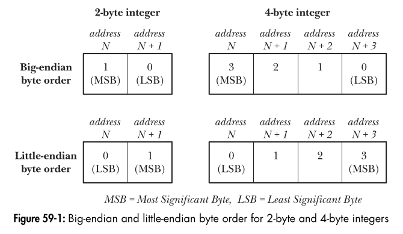

## **Network Byte Order & Endianness in Networking**

When working with network programming, **IP addresses** and **port numbers** must be transmitted in a standard format that all systems can understand, regardless of their architecture. This is where **network byte order** comes in.

---

## **1. Endianness: Big Endian vs. Little Endian**

Different computer architectures store multi-byte integers **differently**:

- **Big Endian:** Most significant byte (MSB) is stored at the **lowest memory address**.
- **Little Endian:** Least significant byte (LSB) is stored at the **lowest memory address**.

### **Example:**

Let’s consider a **32-bit integer** (0x12345678):
| **Endianness** | **Memory Representation** |
|--------------|----------------------|
| **Big Endian** | `12 34 56 78` |
| **Little Endian** | `78 56 34 12` |

- **x86 (Intel, AMD) = Little Endian**
- **Most other architectures (e.g., PowerPC, SPARC, Motorola) = Big Endian**

---



## **2. Network Byte Order**

- Since computers have different **byte order**, network protocols use a **standardized** byte order called **network byte order**.
- **Network byte order is always Big Endian.**
- **IP addresses and port numbers must be converted** to network byte order before transmission.

### **Example Issue (Without Conversion)**

Imagine a server running on a **little-endian** machine (e.g., x86) sending port number **5000 (0x1388)** over a network. If sent **without conversion**, a **big-endian** machine would interpret it as **0x8813**, which is completely wrong.

### **Solution: Convert Between Host and Network Byte Order**

To ensure portability, we use **conversion functions** from `<arpa/inet.h>`.

---

## **3. Conversion Functions**

| **Function** | **Purpose**                        | **Input**                                 | **Output**             |
| ------------ | ---------------------------------- | ----------------------------------------- | ---------------------- |
| `htons(x)`   | Host to Network **Short** (16-bit) | **uint16_t** (e.g., port number)          | **Network byte order** |
| `htonl(x)`   | Host to Network **Long** (32-bit)  | **uint32_t** (e.g., IP address)           | **Network byte order** |
| `ntohs(x)`   | Network to Host **Short** (16-bit) | **uint16_t** (e.g., received port number) | **Host byte order**    |
| `ntohl(x)`   | Network to Host **Long** (32-bit)  | **uint32_t** (e.g., received IP address)  | **Host byte order**    |

---

## **4. Code Example**

### **Converting Port Number (16-bit) and IP Address (32-bit)**

```c
#include <stdio.h>
#include <arpa/inet.h>

int main() {
    uint16_t port = 5000;      // Port number (16-bit)
    uint32_t ip = 0x7F000001;  // 127.0.0.1 (32-bit)

    // Convert to network byte order
    uint16_t net_port = htons(port);
    uint32_t net_ip = htonl(ip);

    printf("Host Port: %d -> Network Port: %d\n", port, net_port);
    printf("Host IP: 0x%x -> Network IP: 0x%x\n", ip, net_ip);

    // Convert back to host byte order
    uint16_t host_port = ntohs(net_port);
    uint32_t host_ip = ntohl(net_ip);

    printf("Converted Back -> Port: %d, IP: 0x%x\n", host_port, host_ip);

    return 0;
}
```

### **Output (on Little Endian System)**

```
Host Port: 5000 -> Network Port: 34823
Host IP: 0x7f000001 -> Network IP: 0x100007f
Converted Back -> Port: 5000, IP: 0x7f000001
```

(Port & IP are correctly restored)

---

## **5. When to Use These Functions**

✅ **Always use `htons()`, `htonl()`, `ntohs()`, and `ntohl()` when:**

- **Setting up a socket address (`sockaddr_in`, `sockaddr_in6`)**
- **Sending IP addresses and port numbers over the network**
- **Receiving network data and converting it back to host byte order**

❌ **Not Needed For:**

- **Sending raw data that does not involve integers** (e.g., strings, binary data).

---

## **6. Summary**

| Feature                                   | **Big Endian (Network Byte Order)** | **Little Endian (Host Byte Order on x86)** |
| ----------------------------------------- | ----------------------------------- | ------------------------------------------ |
| **IP Address (32-bit)**                   | `12 34 56 78`                       | `78 56 34 12`                              |
| **Port Number (16-bit)**                  | `12 34`                             | `34 12`                                    |
| **Function to Convert (Before Sending)**  | `htonl()`, `htons()`                | -                                          |
| **Function to Convert (After Receiving)** | `ntohl()`, `ntohs()`                | -                                          |

### **Takeaways:**

✅ **Network byte order is always Big Endian.**  
✅ **Use conversion functions for portability.**  
✅ **Without conversion, numbers will be misinterpreted on different architectures.**
