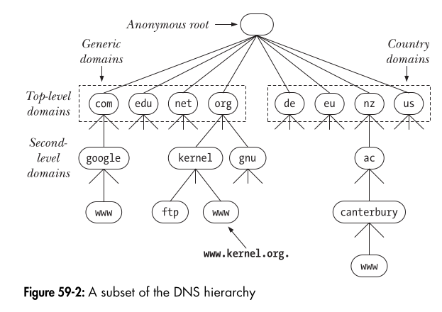

### **Understanding the Domain Name System (DNS) in Simple Terms**  

#### **1. Before DNS: The /etc/hosts File**  
Before DNS existed, computers used a file called **/etc/hosts** to match hostnames (like `google.com`) with their IP addresses (like `142.250.180.14`).  

The file had entries like this:  
```
127.0.0.1 localhost
192.168.1.10 myserver myalias
```
- The first column is the **IP address**.  
- The second column is the **canonical hostname** (official name of the system).  
- Additional columns are **aliases** (alternative names for the same system).  

However, this system **did not scale well**. As more computers joined networks like the Internet, maintaining a single file with millions of IP addresses became impossible.  

#### **2. Why DNS Was Created**  
DNS was introduced to solve this problem by:  
1. **Organizing hostnames in a hierarchy** (like `www.google.com`).  
2. **Using a distributed system** instead of a single file.  
3. **Automatically updating records** across the network.  

---
### **3. How DNS Works**
DNS is like a **phonebook** for the Internet. It converts human-readable domain names (`google.com`) into machine-readable IP addresses (`142.250.180.14`).  

- **DNS Hierarchy**:  
  - The entire DNS system is structured like a **tree**.  
  - Each level in the tree has a **name**, and names are separated by dots (`.`).  

For example, in `www.example.com`:  
- `com` is the **Top-Level Domain (TLD)**.  
- `example` is a **Second-Level Domain**.  
- `www` is a **Subdomain**.  

The full name `www.example.com.` is called a **Fully Qualified Domain Name (FQDN)**. The final dot (`.`) represents the **root** of the hierarchy.  



---
### **4. DNS Servers**
DNS is **not controlled by a single organization**. Instead, it works using **multiple DNS servers** that manage different parts of the hierarchy.  

Each DNS zone has:  
1. **Primary Master Name Server** – The main server that stores the data.  
2. **Slave Name Servers (Backup Servers)** – If the master fails, backups handle requests.  

Changes in DNS records (like updating an IP address) are made **only on the master server**, and updates are automatically sent to backup servers.  

---
### **5. How a Domain Name is Resolved (Converted to an IP Address)**
When a computer needs to find an IP address for a domain, it calls the function **getaddrinfo()**.  

This function:  
- First **checks the local cache** (stored IP addresses from past lookups).  
- If not found, it contacts the **local DNS server**.  
- If the local server does not have the answer, it asks **other DNS servers**.  

---
### **6. Recursive vs. Iterative DNS Resolution**
There are two ways to resolve domain names:  

#### **Recursive Resolution (Full Resolution by One Server)**  
- The **client asks the local DNS server** to find the IP address.  
- The local DNS server does **all the work** by contacting other servers if needed.  
- The final answer is sent back to the client.  

#### **Iterative Resolution (Step-by-Step Process)**
- The **local DNS server** starts by asking a **root server** for help.  
- The root server **does not give the final answer** but tells the local DNS server where to look next.  
- The local server follows **multiple steps** until it finds the correct IP address.  

Example: Resolving `www.otago.ac.nz`  
1. The local DNS server asks a **root name server** about `www.otago.ac.nz`.  
2. The root server refers it to an **nz (New Zealand) DNS server**.  
3. The **nz server** refers it to the **ac.nz (academic) DNS server**.  
4. The **ac.nz server** refers it to the **otago.ac.nz server**, which gives the final IP address.  

---
### **7. Completing Partial Domain Names**
If you type only a **partial name** (e.g., `octavo` instead of `octavo.otago.ac.nz`), the system will try to **guess the full name** using rules in the `/etc/resolv.conf` file.  

For example:  
- If you type `ssh octavo`, the system may try **octavo.otago.ac.nz** automatically.  

---
### **8. Top-Level Domains (TLDs)**
The highest level of the DNS hierarchy consists of **Top-Level Domains (TLDs)**.  

There are two types of TLDs:  
1. **Generic TLDs (gTLDs)** – Used globally:  
   - `.com` (commercial)  
   - `.org` (organizations)  
   - `.net` (networks)  
   - `.gov` (government)  
   - `.mil` (military)  
   - `.int` (international organizations)  
2. **Country Code TLDs (ccTLDs)** – Assigned to countries:  
   - `.de` (Germany)  
   - `.uk` (United Kingdom)  
   - `.nz` (New Zealand)  
   - `.in` (India)  

Some countries **divide their domains further**. For example, New Zealand has:  
- `.ac.nz` (academic institutions)  
- `.co.nz` (commercial organizations)  
- `.govt.nz` (government agencies)  

---
### **Summary**
1. **Before DNS**, computers used a manual `/etc/hosts` file for hostname-to-IP mapping.  
2. **DNS organizes names hierarchically** (e.g., `www.google.com`).  
3. **DNS servers** store and manage name-to-IP mappings.  
4. **Recursive resolution** lets a DNS server do all the work, while **iterative resolution** involves multiple steps.  
5. **Partial names can be auto-completed** based on local DNS settings.  
6. **TLDs categorize domains** into **generic** (like `.com`, `.org`) and **country-specific** (like `.nz`, `.de`).  

This system allows the Internet to **function efficiently**, even with millions of websites. 🚀