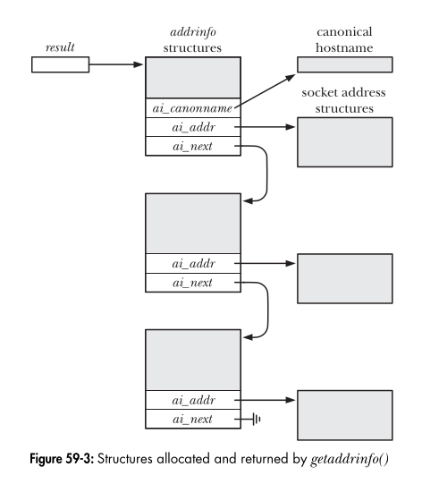

### **Breakdown of `getaddrinfo()` in Simple Terms**

The `getaddrinfo()` function helps in converting a **hostname** (like `"google.com"`) or a **service name** (like `"http"`) into a **list of IP addresses and port numbers** that can be used to create a socket.

---

### **Function Prototype**

```c
#include <sys/socket.h>
#include <netdb.h>

int getaddrinfo(const char *host, const char *service,
                const struct addrinfo *hints, struct addrinfo **result);
```

#### **Return Value:**

- Returns `0` on success.
- Returns a nonzero error code on failure.

---

### **Parameters Explained**

#### **1. `host`**

- Can be a **hostname** (e.g., `"google.com"`) or a **numeric IP address** (e.g., `"192.168.1.1"` or `"2001:db8::1"` for IPv6).
- If `NULL`, it means the function should find an address based on the other parameters.

#### **2. `service`**

- Can be a **service name** (e.g., `"http"`, `"ftp"`, `"ssh"`), which is mapped to a port number automatically.
- Can also be a **numeric port number** (e.g., `"80"` for HTTP).

#### **3. `hints`**

- A structure that tells `getaddrinfo()` what type of addresses to return (e.g., IPv4 or IPv6).
- Can be `NULL` if no specific filtering is required.

#### **4. `result`**

- A pointer to a linked list of `addrinfo` structures that contains the resolved addresses.

---

### **`addrinfo` Structure**

This structure stores information about the resolved addresses.

```c
struct addrinfo {
    int ai_flags;           // Options (e.g., AI_PASSIVE, AI_CANONNAME)
    int ai_family;          // Address family (AF_INET for IPv4, AF_INET6 for IPv6)
    int ai_socktype;        // Type of socket (SOCK_STREAM for TCP, SOCK_DGRAM for UDP)
    int ai_protocol;        // Protocol (0 for automatic selection)
    size_t ai_addrlen;      // Length of ai_addr
    char *ai_canonname;     // Canonical name (if AI_CANONNAME is set)
    struct sockaddr *ai_addr;  // Pointer to socket address structure
    struct addrinfo *ai_next;  // Pointer to next address in list
};
```

---

### **Why Does `getaddrinfo()` Return a Linked List?**

- A hostname may resolve to **multiple IP addresses** (e.g., if the host has multiple network interfaces).
- If `hints.ai_socktype == 0`, both **TCP (`SOCK_STREAM`)** and **UDP (`SOCK_DGRAM`)** results are returned.
- For IPv6, it may return **IPv4-mapped addresses**.

---



### **Understanding the `hints` Argument**

The `hints` structure allows us to specify filters for the returned addresses.

#### **Commonly Used Fields in `hints`**

| Field         | Description                                                |
| ------------- | ---------------------------------------------------------- |
| `ai_family`   | `AF_INET` (IPv4), `AF_INET6` (IPv6), or `AF_UNSPEC` (both) |
| `ai_socktype` | `SOCK_STREAM` (TCP) or `SOCK_DGRAM` (UDP)                  |
| `ai_protocol` | Typically `0` (auto-select protocol)                       |
| `ai_flags`    | Additional options (see below)                             |

#### **Common `ai_flags` Values**

| Flag             | Description                                                                                   |
| ---------------- | --------------------------------------------------------------------------------------------- |
| `AI_PASSIVE`     | Used for **server sockets**. Returns `INADDR_ANY` (`0.0.0.0` for IPv4, `::` for IPv6).        |
| `AI_CANONNAME`   | Returns the **canonical** hostname.                                                           |
| `AI_NUMERICHOST` | Disables DNS lookup. `host` must be an IP address.                                            |
| `AI_NUMERICSERV` | Disables service name lookup. `service` must be a number.                                     |
| `AI_V4MAPPED`    | Returns IPv4-mapped IPv6 addresses if no IPv6 is found.                                       |
| `AI_ADDRCONFIG`  | Returns only IPv4 if the system has an IPv4 address, and only IPv6 if it has an IPv6 address. |

---

### **Example: Resolving an Address**

Here’s a simple C program that demonstrates how to use `getaddrinfo()`.

```c
#include <stdio.h>
#include <stdlib.h>
#include <sys/types.h>
#include <sys/socket.h>
#include <netdb.h>
#include <string.h>
#include <arpa/inet.h>

int main(int argc, char *argv[]) {
    struct addrinfo hints, *res, *p;
    int status;
    char ipstr[INET6_ADDRSTRLEN];

    if (argc != 2) {
        fprintf(stderr, "Usage: %s <hostname>\n", argv[0]);
        return 1;
    }

    memset(&hints, 0, sizeof hints);
    hints.ai_family = AF_UNSPEC; // IPv4 or IPv6
    hints.ai_socktype = SOCK_STREAM; // TCP

    if ((status = getaddrinfo(argv[1], "http", &hints, &res)) != 0) {
        fprintf(stderr, "getaddrinfo error: %s\n", gai_strerror(status));
        return 2;
    }

    printf("IP addresses for %s:\n\n", argv[1]);

    for (p = res; p != NULL; p = p->ai_next) {
        void *addr;
        char *ipver;

        if (p->ai_family == AF_INET) { // IPv4
            struct sockaddr_in *ipv4 = (struct sockaddr_in *)p->ai_addr;
            addr = &(ipv4->sin_addr);
            ipver = "IPv4";
        } else { // IPv6
            struct sockaddr_in6 *ipv6 = (struct sockaddr_in6 *)p->ai_addr;
            addr = &(ipv6->sin6_addr);
            ipver = "IPv6";
        }

        inet_ntop(p->ai_family, addr, ipstr, sizeof ipstr);
        printf("%s: %s\n", ipver, ipstr);
    }

    freeaddrinfo(res);
    return 0;
}
```

#### **How It Works:**

1. It takes a hostname as input (e.g., `./a.out google.com`).
2. It calls `getaddrinfo()` with `hints.ai_family = AF_UNSPEC` to get both IPv4 and IPv6 addresses.
3. It loops through the linked list returned by `getaddrinfo()`, printing each IP address.
4. It uses `inet_ntop()` to convert binary IP addresses to human-readable format.

---

### **Key Takeaways**

- `getaddrinfo()` replaces older functions like `gethostbyname()` and `getservbyname()`.
- It works with both IPv4 and IPv6.
- It provides flexibility via the `hints` argument.
- It dynamically allocates memory, so `freeaddrinfo()` must be called to avoid memory leaks.
- It supports both **client-side (connecting to a server)** and **server-side (binding to an address)** network programming.
